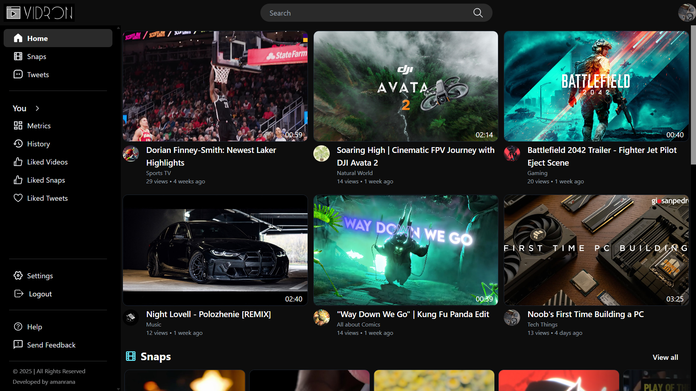
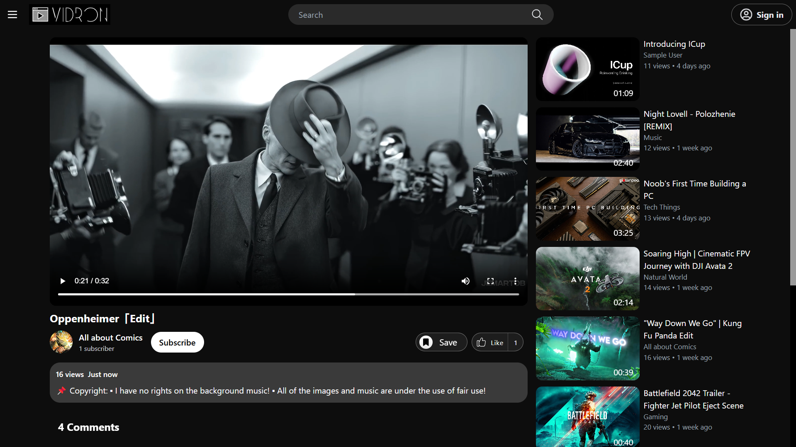
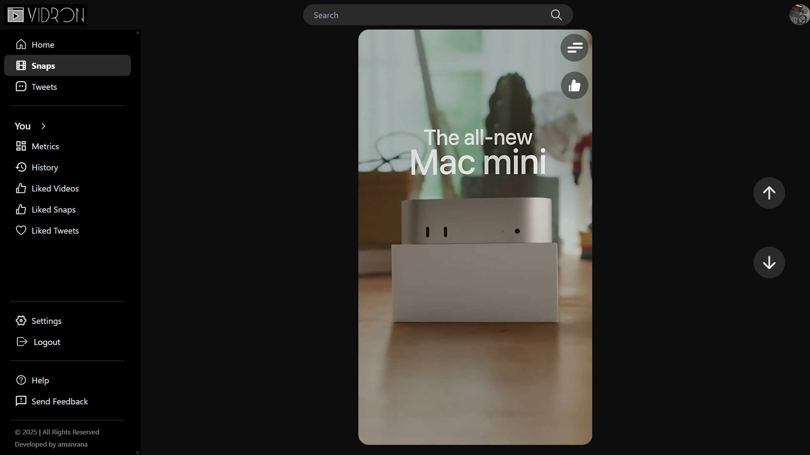
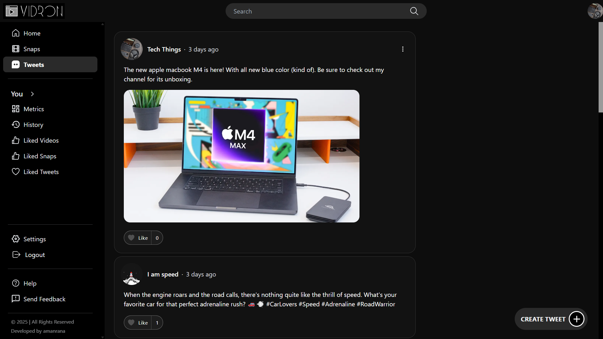
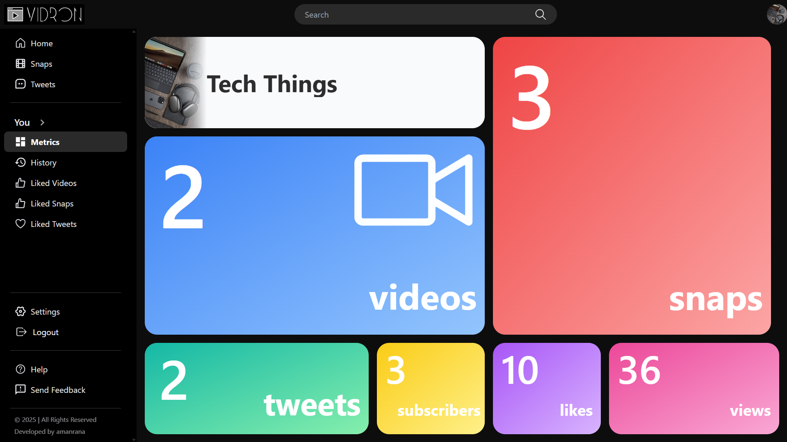
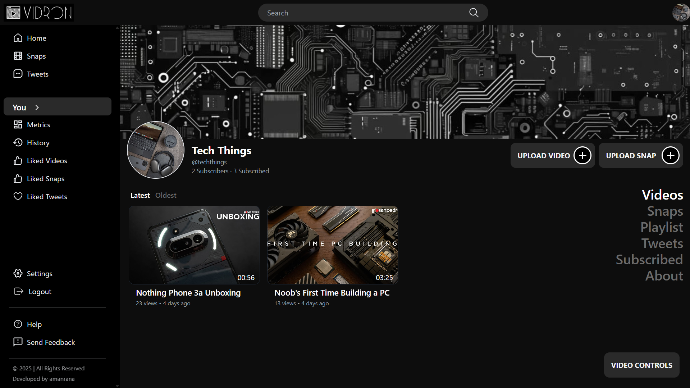

# Vidron

Vidron is a dynamic video streaming platform designed to deliver an engaging viewing experience. Users can explore a diverse collection of content, including full-length videos and short-form snaps. The platform allows seamless video playback, intuitive navigation, and a user-friendly interface for managing channels and content. Built with scalability in mind, Vidron offers smooth performance while handling media uploads and streaming efficiently.

  

## Table of Contents

- [Features](#features)
- [Technologies Used](#technologies-used)
- [Live Website](#live-website)
- [Screenshots](#screenshots)
- [License](#license)

  

## Features

- **User Authentication**: Users can **sign up** or **log in** to access exclusive features.
- **Video Streaming**:
  - Browse and watch a variety of videos.
  - Play full-length videos and short-form snaps.
- **Upload and Manage Videos**:
  - Logged-in users can **upload**, **edit**, and **delete** their videos.
- **Tweets Page**: A dedicated section where users can explore trending tweets related to videos.
- **Metrics Dashboard**: Users can track video performance, including views, likes, and engagement stats.
- **Channel Management**: Users can create and customize their channels.
- **Responsive Design**: Fully optimized for desktop, tablet, and mobile devices.
- **Fast Performance**: Hosted on **Vercel** for smooth and efficient streaming.

  

## Technologies Used

### Frontend:

- **React**: A JavaScript library for building interactive user interfaces.
- **Tailwind CSS**: A utility-first CSS framework for modern styling.
- **Vite**: A fast build tool for frontend development.
- **React Router DOM**: For seamless page navigation.

### Backend & Services:

- **Node.js & Express**: Server-side backend framework.
- **MongoDB**: NoSQL database for storing user and video data.
- **Multer & Cloudinary**: For handling video uploads and cloud storage.
- **JWT (JSON Web Tokens)**: Secure user authentication and authorization.

  

## Live Website

Check out **Vidron** live here: [Vidron](https://vidron.vercel.app)

Use the following credentials to log in and explore the full functionality of the website:

- **Email**: user@example.com
- **Password**: password

  

## Screenshots

### Homepage

### Video page

### Snap Page

### Tweets Page

### Metrics Page

### Channel Page

  

## License

This project is created for **learning and demonstration purposes only**. The source code is available for reference but should not be used for commercial projects without permission.
